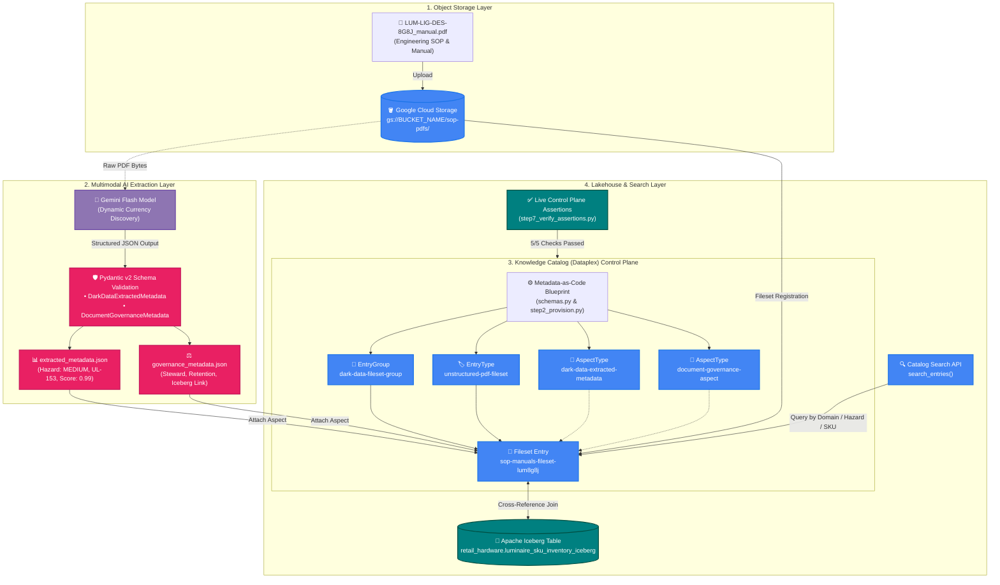

# Unstructured Dark Data Governance: Gemini Multimodal & Google Cloud Knowledge Catalog

[](https://cloud.google.com/dataplex)
[](https://cloud.google.com/vertex-ai)
[](https://docs.pydantic.dev/)
[](https://iceberg.apache.org/)
[](https://www.python.org/)
[](./devrel-demos/codelabs/metadata-as-code-lab/step7_verify_assertions.py)
[](./devrel-demos/LICENSE)

> An enterprise **Metadata-as-Code** framework that automatically illuminates, extracts, and governs unstructured "Dark Data" (engineering PDFs, SOPs, and compliance manuals) using **Gemini Multimodal AI**, **Pydantic Type Schemas**, and **Google Cloud Knowledge Catalog (Dataplex)** with bidirectional linkage to **Apache Iceberg Lakehouse** tables.

---

## Executive Overview & Business Value

In global enterprises, **80% to 90% of all generated data is "Dark Data"**—unstructured technical specifications, standard operating procedures (SOPs), safety certifications, and warranty documents resting dormant in object storage (Google Cloud Storage, Amazon S3). Because traditional metadata tools only inspect structured relational headers, dark data remains invisible, unindexed, untagged, and inaccessible to analytics engines, governance audits, and downstream AI agents.

This project delivers an end-to-end, production-grade **Metadata-as-Code pipeline** that bridges this gap:
1. **Multimodal Document Understanding**: Analyzes raw PDF manuals using Gemini's flagship multimodal model via the unified `google-genai` SDK on Vertex AI.
2. **Schema-First Extraction**: Enforces strict contract validation using **Pydantic v2** models, capturing operational hazard levels, compliance standards, and authoring provenance with confidence scores.
3. **Knowledge Catalog Infrastructure-as-Code**: Declaratively provisions custom Dataplex `EntryGroups`, `EntryTypes`, and typed `AspectTypes` representing business and governance schemas.
4. **Lakehouse Cross-Referencing**: Binds extracted unstructured document metadata directly to structured **Apache Iceberg** analytical tables in BigQuery/Dataplex.
5. **Continuous Control Plane Verification**: Automatically verifies live Google Cloud control plane state with zero-mock assertions.

---

## Architecture

The following diagram illustrates the lifecycle of dark data transformation—from raw PDF ingestion in Cloud Storage to governed discovery in Google Cloud Knowledge Catalog:



---

## Key Technical Features

### 1. Dynamic Gemini Flagship Model Currency Discovery
Rather than hardcoding brittle model identifiers that risk deprecation, [`step4_extract_metadata.py`](./devrel-demos/codelabs/metadata-as-code-lab/step4_extract_metadata.py) dynamically queries the Vertex AI model registry. It filters for GA-channel Flash models, parses semantic version tuples, and automatically binds to the highest available generation (e.g., Gemini 2.x/3.x GA).

### 2. Schema-First Metadata-as-Code
All governance metadata is strongly typed using **Pydantic v2** in [`schemas.py`](./devrel-demos/codelabs/metadata-as-code-lab/schemas.py), ensuring data contracts are validated before reaching the cloud catalog:
- `DarkDataExtractedMetadata`: Document title, domain ontology, operational hazard level (`LOW`, `MEDIUM`, `HIGH`, `CRITICAL`), author provenance, version revision, technical summary, and confidence score.
- `DocumentGovernanceMetadata`: Regulatory compliance standards (UL-153, FCC Part 15, CE-LVD, RoHS), stewardship owner, lifecycle retention policy, and Lakehouse Iceberg cross-reference table.

### 3. Native Dataplex Custom Aspect Blueprints
The pipeline translates Pydantic schemas into native Google Cloud Knowledge Catalog `AspectType` definitions with precise field types (strings, doubles) and attaches them directly to the fileset `Entry` using atomic field masks.

### 4. Unstructured-to-Structured Lakehouse Federation
A primary enterprise innovation of this architecture is linking unstructured fileset entries with structured analytical data:
```json
{
  "compliance_classifications": "UL-153 Portable Luminaires, FCC Part 15, CE-LVD, RoHS",
  "stewardship_owner": "Global Hardware Safety & Lighting Systems Engineering",
  "retention_policy": "10-Year Active Product Lifecycle Archival",
  "lakehouse_cross_ref_table": "lakehouse.build-with-ai-488112.retail_hardware.luminaire_sku_inventory_iceberg",
  "governance_status": "VERIFIED_PRODUCTION"
}
```
Downstream data consumers can search Knowledge Catalog for hazard levels or compliance tags and immediately discover the corresponding Apache Iceberg inventory table for analytical queries.

### 5. Automated Control Plane Assertions
The test suite [`step7_verify_assertions.py`](./devrel-demos/codelabs/metadata-as-code-lab/step7_verify_assertions.py) validates live Google Cloud control plane state:
1. EntryGroup resource existence and URI match.
2. EntryType blueprint registration.
3. Both custom AspectTypes deployed and active in the target region.
4. Fileset Entry contains all bound aspect payloads with valid confidence metrics and Lakehouse cross-references.
5. Knowledge Catalog search indexing returns discoverable results for the fileset.

---

## Project Structure

```
Unstructured-Dark-Data-Gemini-and-Knowledge-Catalog/
│
├── .gitignore                                      # Production Git ignore rules
├── README.md                                       # Executive portfolio documentation
│
└── devrel-demos/
    ├── README.md                                   # DevRel demos overview
    ├── LICENSE                                     # Apache 2.0 License
    └── codelabs/
        └── metadata-as-code-lab/
            ├── schemas.py                          # Pydantic schemas & Dataplex Aspect templates
            ├── requirements.txt                    # Project dependency specification
            ├── LUM-LIG-DES-8G8J_manual.pdf         # Sample unstructured engineering SOP PDF
            ├── extracted_metadata.json             # AI-extracted metadata payload
            ├── governance_metadata.json            # Governance & Lakehouse metadata payload
            │
            ├── step2_provision.py                  # Provisions EntryGroup, EntryType & AspectTypes
            ├── step3_register_fileset.py           # Uploads PDF to GCS & creates Catalog Fileset Entry
            ├── step4_extract_metadata.py           # Multimodal Gemini extraction & schema validation
            ├── step5_attach_aspects.py             # Attaches validated aspects to Catalog Entry
            ├── step6_search_catalog.py             # Federated search query over Knowledge Catalog
            ├── step7_verify_assertions.py          # End-to-end verification assertions against live GCP
            └── cleanup.py                          # Reverse-dependency teardown & resource removal
```

---

## Step-by-Step Implementation Guide

### Prerequisites
- Python 3.10+
- Google Cloud Platform account with active billing
- `gcloud` CLI installed and authenticated (`gcloud auth application-default login`)
- Enabled APIs: `dataplex.googleapis.com`, `aiplatform.googleapis.com`, `storage.googleapis.com`

### 1. Environment Setup

To avoid dependency conflicts with system-level packages, initialize an isolated virtual environment:

```bash
cd devrel-demos/codelabs/metadata-as-code-lab

# Initialize dedicated virtual environment
python3 -m venv .venv
source .venv/bin/activate

# Upgrade package installer and install pinned dependencies
pip install --upgrade pip
pip install -r requirements.txt
```

Set your Google Cloud environment variables:

```bash
export PROJECT_ID="your-gcp-project-id"
export REGION="us-central1"
export BUCKET_NAME="${PROJECT_ID}-dark-data-manuals"
export GEMINI_LOCATION="global"
```

---

### 2. Provision Knowledge Catalog Infrastructure (IaC)

Deploy the catalog governance containers and aspect type definitions:

```bash
python3 step2_provision.py
```

*Output:*
```
Created EntryGroup: projects/<PROJECT_ID>/locations/us-central1/entryGroups/dark-data-fileset-group
Created EntryType : projects/<PROJECT_ID>/locations/us-central1/entryTypes/unstructured-pdf-fileset
Created AspectType: projects/<PROJECT_ID>/locations/us-central1/aspectTypes/dark-data-extracted-metadata
Created AspectType: projects/<PROJECT_ID>/locations/us-central1/aspectTypes/document-governance-aspect
```

---

### 3. Register Unstructured Fileset in Cloud Storage

Upload the sample engineering manual to Cloud Storage and register the logical Fileset Entry:

```bash
python3 step3_register_fileset.py
```

*Output:*
```
Created GCS Bucket: <PROJECT_ID>-dark-data-manuals in us-central1
Uploaded 'LUM-LIG-DES-8G8J_manual.pdf' to gs://<PROJECT_ID>-dark-data-manuals/sop-pdfs/LUM-LIG-DES-8G8J_manual.pdf
Created Fileset Entry: projects/<PROJECT_ID>/locations/us-central1/entryGroups/dark-data-fileset-group/entries/sop-manuals-fileset-lum8g8j
```

---

### 4. Multimodal AI Extraction with Gemini

Execute dynamic model discovery, extract structured fields from the raw PDF bytes, and enforce Pydantic validation:

```bash
python3 step4_extract_metadata.py
```

*Extracted Payload Sample (`extracted_metadata.json`):*
```json
{
  "document_title": "LUM-LIG-DES-8G8J Contemporary Linen Desk Lamp - Technical Manual & SOP Rev 4.2",
  "domain_ontology": "Electrical Hardware & Lighting Systems",
  "operational_hazard_level": "MEDIUM",
  "author_provenance": "Global Hardware Safety & Lighting Systems Engineering",
  "version_provenance": "Rev 4.2",
  "document_summary": "Standard operating procedures and electrical thermal safety limits for SKU LUM-LIG-DES-8G8J. Outlines 120V AC thermal and shock risks with compliance verification across UL-153, FCC Part 15, CE-LVD, and RoHS.",
  "confidence_score": 0.99
}
```

---

### 5. Attach Aspects to Knowledge Catalog Entry

Bind the validated JSON metadata payloads to the live fileset entry in Dataplex:

```bash
python3 step5_attach_aspects.py
```

*Output:*
```
Attaching Aspect 'dark-data-extracted-metadata' to entry 'sop-manuals-fileset-lum8g8j'...
Attaching Aspect 'document-governance-aspect' to entry 'sop-manuals-fileset-lum8g8j'...
✓ Successfully attached custom governance and extraction aspects!
```

---

### 6. Federated Search & Discovery

Execute queries against the Knowledge Catalog search index to discover dark data assets and inspect Lakehouse cross-references:

```bash
python3 step6_search_catalog.py
```

*Output:*
```
Executing Knowledge Catalog search query: 'entrygroup=.../dark-data-fileset-group name:sop-manuals-fileset-lum8g8j'...

✓ Discovered 1 governed asset(s) in Knowledge Catalog:

[1] Entry Resource Name : projects/<PROJECT_ID>/locations/us-central1/entryGroups/dark-data-fileset-group/entries/sop-manuals-fileset-lum8g8j
    Fully Qualified Name: dataplex:<PROJECT_ID>.us-central1.dark-data-fileset-group.sop-manuals-fileset-lum8g8j
    Entry Type          : projects/<PROJECT_ID>/locations/us-central1/entryTypes/unstructured-pdf-fileset
    Physical Storage URI: gs://<PROJECT_ID>-dark-data-manuals/sop-pdfs/LUM-LIG-DES-8G8J_manual.pdf
    Domain Ontology     : Electrical Hardware & Lighting Systems
    Hazard Level        : MEDIUM
    Compliance Codes    : UL-153 Portable Luminaires, FCC Part 15, CE-LVD, RoHS
    Lakehouse Join Table: lakehouse.<PROJECT_ID>.retail_hardware.luminaire_sku_inventory_iceberg
```

---

### 7. Run Verification Test Suite

Verify that all cloud resources, schemas, and bindings meet production assertions:

```bash
python3 step7_verify_assertions.py
```

*Live Test Results:*
```
Running substantive end-to-end verification assertions...
✓ All 5 substantive verification assertions passed against live Google Cloud control plane state!
Verification exit code: 0
```

---

### 8. Teardown & Clean Up

To safely tear down all provisioned Google Cloud resources in correct reverse-dependency order:

```bash
python3 cleanup.py
```

*Cleanup Execution:*
```
[1/5] Detached aspects and deleted Entry: sop-manuals-fileset-lum8g8j
[2/5] Deleted AspectTypes: dark-data-extracted-metadata, document-governance-aspect
[3/5] Deleted EntryType: unstructured-pdf-fileset
[4/5] Deleted EntryGroup: dark-data-fileset-group
[5/5] Purged and deleted GCS bucket: <PROJECT_ID>-dark-data-manuals
✓ Teardown complete. Zero dangling cloud resources remain.
```

---

## Technology Stack

| Domain | Technology | Purpose |
| :--- | :--- | :--- |
| **Cloud Catalog** | [Google Cloud Dataplex (Knowledge Catalog)](https://cloud.google.com/dataplex) | Unified metadata catalog, EntryGroups, EntryTypes, and custom AspectTypes |
| **Generative AI** | [Gemini Multimodal Flash (Vertex AI)](https://cloud.google.com/vertex-ai) | Multimodal visual and document comprehension over complex technical PDFs |
| **Data Contracts** | [Pydantic v2](https://docs.pydantic.dev/) | Strict runtime data validation, schema enforcement, and type safety |
| **Lakehouse** | [Apache Iceberg](https://iceberg.apache.org/) | Open table format for analytical cross-referencing between unstructured & structured data |
| **Cloud Storage** | [Google Cloud Storage (GCS)](https://cloud.google.com/storage) | Highly scalable object storage for raw unstructured filesets |
| **SDK & Tooling** | `google-genai`, `google-cloud-dataplex`, `pandas` | Official Google Cloud client libraries and data processing tools |

---

## Engineering Standards & Best Practices

- **PEP 668 Environment Isolation**: Prevents dependency pollution and version collisions by utilizing isolated virtual environments (`venv`) and pinned requirements.
- **Fail-Fast Configuration**: Validates mandatory environment variables (`PROJECT_ID`, `REGION`, `BUCKET_NAME`) at process boot.
- **Idempotent Resource Management**: All provisioning scripts handle `AlreadyExists` exceptions gracefully, allowing safe re-runs and pipeline restarts.
- **Exponential Backoff**: Handles eventual consistency in Google Cloud search indexing with adaptive polling.
- **Zero Mock Verification**: Every test in `step7_verify_assertions.py` validates live control plane REST/gRPC responses.

---

## Author & Contact

**Peter Okwukogu**  
*Cloud & Data Solutions Architect | AI Systems Engineer*  
- **GitHub**: [@iPablo26](https://github.com/iPablo26)  
- **LinkedIn**: [Connect on LinkedIn](https://www.linkedin.com)  

---

## License

This project is licensed under the **Apache 2.0 License** — see the [LICENSE](./devrel-demos/LICENSE) file for details.
